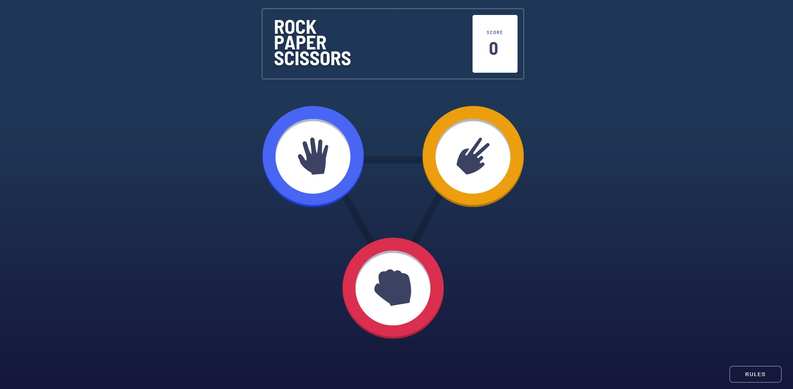

# Frontend Mentor - Rock, Paper, Scissors solution

This is a solution to the [Rock, Paper, Scissors challenge on Frontend Mentor](https://www.frontendmentor.io/challenges/rock-paper-scissors-game-pTgwgvgH). Frontend Mentor challenges help you improve your coding skills by building realistic projects. 

## Table of contents

- [Overview](#overview)
  - [The challenge](#the-challenge)
  - [Screenshot](#screenshot)
  - [Links](#links)
- [My process](#my-process)
  - [Built with](#built-with)
  - [What I learned](#what-i-learned)
  - [Continued development](#continued-development)
- [Author](#author)

**Note: Delete this note and update the table of contents based on what sections you keep.**

## Overview
Code implementation of frontend mentor rock, paper, scissors game

### The challenge

Users should be able to:

- View the optimal layout for the game depending on their device's screen size
- Play Rock, Paper, Scissors against the computer

### Screenshot



### Links

- Solution URL: [Add solution URL here](https://github.com/ovie009/rock-paper-scissors-master)
- Live Site URL: [Add live site URL here](https://ovie009.github.io/rock-paper-scissors-master/)

## My process
- Semantic HTML5 markup
- CSS
- Download and add JQuery
- Write Game Logic
- Manipulate HTML Elements
### Built with

- Semantic HTML5 markup
- Flexbox
- Mobile-first workflow
- [JQuery](jquery-3.6.0.min.js) - For button functionality and game logic

**Note: These are just examples. Delete this note and replace the list above with your own choices**

### What I learned

How loop through an array from the first to last element and back to the first continuosly, using the modulus(remainder) operator '%' and setInterval


```js
let x = 0;

setInterval(() => {
    let y = x % boxShadow.length;
    $(element).css('boxShadow', boxShadow[y]);
    x++;
}, 500);
```

### Continued development

make the buttons react when you click on them, and adding of sound to the game to make iy more interesting

## Author

- Website - [Iffie Ovie](https://ovie009.github.io/portfolio/)
- Frontend Mentor - [@ovie009](https://www.frontendmentor.io/profile/ovie009)
- Twitter - [@yourusername](https://www.twitter.com/iffieovie)